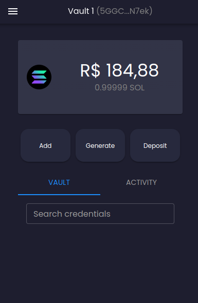

# MetaVault: A Blockchain Credential Manager

MetaVault is a blockchain credential manager that allows you to store your credentials in a decentralized way.

It is a decentralized application (dApp) that runs on the Solana blockchain platform. It is a browser extension application and interacts with the Solana blockchain on its own as a wallet manager.

## Features

- Store your credentials in a decentralized way
- Generate new credentials
- Fill your credentials in a web page automatically
- Group your credentials in vaults
- Manage all credentials with a single password
- Import and export your vaults
- Sync your credentials across multiple devices (so far the software is only available as an extension for chrome desktop)

## Installation

### Chrome

1. Go to [releases page](https://github.com/Ridersk/blockchain-credential-manager/releases) and select the latest version of the extension (don't get the releases that are marked as "Pre Release", they are versions no fully tested).
2. In `Assets`, download the zip file starting with `app-` and ending with `.zip`.
3. Extract the zip file and you will find a folder called `app`. In this folder, you will find a folder called `build`.
4. Go back to Chrome and open the extensions page (chrome://extensions/).
5. Activate the developer mode (top right corner).  
    
6. Click on `Load unpacked` and select the `build` folder from the extracted zip file.  
    
7. The extension should be installed and you should see the MetaVault icon in the top right corner of your browser.  
   

## Usage

### Create a new vault

1. Click on the MetaVault icon in the top right corner of your browser.
2. If it's the first time you use the extension, you will be asked to create a new vault. Click on `Create a new vault`.  
    
3. Enter a password and confirm it.  
   
4. Click on `Next`.
5. A recovery phrase will be shown to you. Write it down and store it in a safe place. You will need it to recover your vault in another device.  
    
6. Click on `Next`.
7. Confirm the recovery phrase.  
    
8. Click on `Confirm`.
9.  Now, several generated accounts or vaults will be shown to you. Choose one.  
    
10. Done! You have created your first vault.

### Import a vault

1. Click on the MetaVault icon in the top right corner of your browser.
2. If it's the first time you use the extension in a new device or browser, you will be asked to create a new vault or import one. Click on `Import a vault`.
3. Provide the recovery phrase and password used on the other device (so far, it is not possible to change this master password which manages all credentials).  
    
4. Select a account in the generated accounts list.
5. Done! You have imported your vault.

### Add a new credential

1. To create a new credential, it is necessary own a amount of SOLs in the account you want to use. If you don't have SOLs, you can get some from the `Home Page` > Deposit (It only works in Localhost, Devnet and Testnet).
2. In extension home page, click on `Add a new credential`.  
    
3. Add the credential's name, username and password.  
    
4. Click on `Save`.
5. Done, you have just created a new credential.
6. In home page, you will see the new credential in the list.  
    

- Clicking on the credential will show you the details. Also is possible to edit or delete the credential.
    

### Use credentials in pages

When you are in a web page, you can see a action button attached in right side of `sign in` forms. Clicking on it will open a popup with the stored credentials that could be used in the current site.  

Also it is possible create a new credential or generate a new password for a new credential clicking on `Generate` button that will open a window with "Secret Generator" tool.  

### Settings

1. Open the navigation menu (top left corner).
2. Go to `Settings`.
3. Several options will be shown to you.  
    

__Show Recovery Phrase:__

1. Click on `Show Recovery Phrase`.
2. The recovery phrase will be shown to you.

__Change network:__

1. Go to `Change network`.
2. Choose the network you want to use (you can choose between local, devnet, testnet, mainnet).

__Change language:__

1. Go to `Change language`.
2. Choose the language you want to use (you can choose between English and Brazilian Portuguese).

__Add a new account:__

1. Go to `Add a new account`.
2. Give a name for the new account/vault.
3. Select a generated account.
4. A new account will be created and shown in the list of accounts in the navigation menu.
   [navigation_menu_multiple_accounts]()
5. With multiple vault it is possible group credentials in different contexts. For example, you can have a vault for your personal credentials and another one for your work credentials.

__Reset Wallet:__

- This setting allows you to reset your wallet. It will delete all your credentials and vaults. Note that accounts and credentials will only be erased from your device and remain on the blockchain. If you want to delete them from the blockchain, you will need to do it manually.

1. Go to `Reset Wallet`.
2. Enter your password and confirm.
